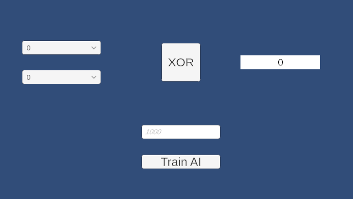
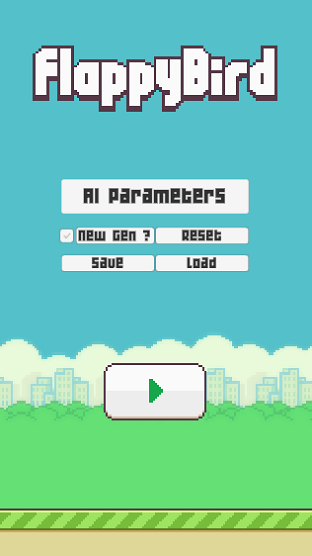
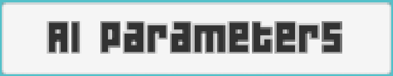
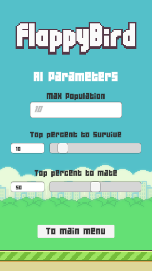
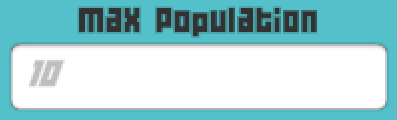
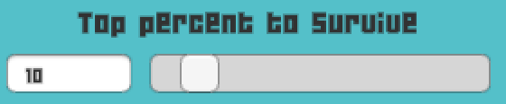
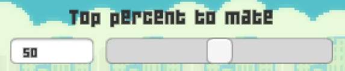

# MachineLearning_Exercise

The goal of this exercise is to learn the ins and outs of machine learning, and in this project, of genetic algorithms.  
The exercise present itself in two step:  
> Step 1 - XOR Training  
> Step 2 - FlappyBird  

This project was done on Unity.
 

Youtube link: https://www.youtube.com/watch?v=KEGq7vo6qQA

### XOR Training
***
I had a program that could display a result depending of imputs, the goal was to use a genetic algorithm to train the AI to display the closest value possible to a list of targets we gave it.  
To check which AI was the closest to the set of targets, I calculated the average of all the distances between the gene and the target it is assaciated with. 
     
    float CalculFitness()
    {
        float value = 0.0f;
        float[] target = Population.Instance.Target;
        for (int i = 0; i < target.Length; ++i)
        {
            float targetGene = target[i];
            float gene = Chromosome[i];
            value += Mathf.Abs(targetGene - gene);
        }
        return value / target.Length;
    }

   

### Flappy Bird
***
#### How the AI works
Now that I discovered a little bit of what genetic algo could do, it was time to try implementing it in a game. And the game I chose was Flappy Bird. 
I based my AI on the NEAT algorithm, wich means I multiply inputs by weights and add them into a sum before passing it into an activation function. 
To know wich AI was better, I used, as fitness, how long the AI has survived. 
As for the genom shared with the offprings, I used wheights:  

     float TopHeightW;     //Weight of distance between bird and top pipe on y-axis
     float BotHeightW;     //Weight of distance between bird and bot pipe on y-axis

     float LastDistW;      //Weight of distance between bird and last pipe x-axis 
     float NextDistW;      //Weight of distance between bird and next pipe x-axis 

`TopHeightW` and `BotHeightW` are used to maintain the bird height to pass a target pipe. 
`LastDistW` and `NextDistW` are used to decide wich of the last or next pipe the bird should the bird maintain it's height. 
 
As for how these weights are used, they are each multiplied by a value, which are in turn added into a sum.
As an example, to maintain height, I calculate the distance between the bird and to top/bot pipe, wich I then multiply by it's corresponding wheight. I then add the two value into a sum. 

     private float CalculateHeightWeightSum(PipeBehaviour pSumTarget)
     {
         float topHeight     = pSumTarget.TopPipeHeight.transform.position.y;
         float botHeight     = pSumTarget.BotPipeHeight.transform.position.y;
         float birdHeight    = transform.position.y;
         float topDist       = Mathf.Abs(topHeight - birdHeight);
         float botDist       = Mathf.Abs(botHeight - birdHeight);
         return (topDist * Individual.TopHeightW) +
             (botDist * Individual.BotHeightW);
     }

This sum is then passed trough the activation function TanH function, and if the value returned is greater than 0, the bird flap. 

     float result = (float)Math.Tanh(weightSum);
     return result > 0f ? true : false;

### Algorithm parameters

          
          This button send you to parameters to manipulate the genetic algo.
     

          
          This toggle allows you to decide weither or not you want a new generation to be generated.
     

          
          This button allows you to reset the species, generation goes back to 0 and AI is blank.
     

          
          Allows you to save and load an AI. Only one though so be careful.

     
 
 

     You can access it by pressing AI Param button. 

     

          
          This input field give the algo the maximum individuals in a population.
     

          
          Here you can choose the percentage of the birds to keep into the next gen, starting by those with the best fitness.
     

          
          Here you can choose wich percentage of the survivors are allowed to produce offsprings.

 
 

### Sources

>https://www.geeksforgeeks.org/genetic-algorithms/  
>https://www.youtube.com/watch?v=OGHA-elMrxI
